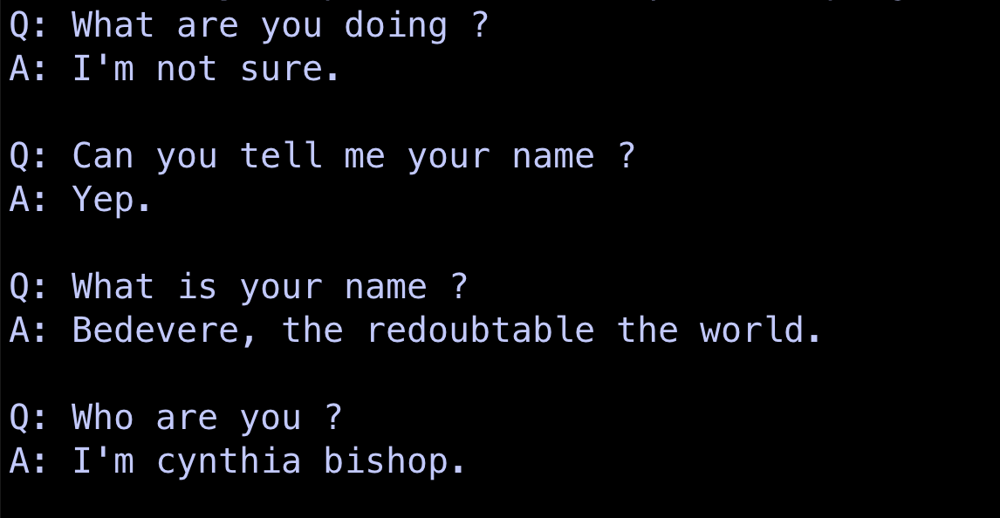

# 基于深度学习的对话系统
### 1. 前言

小时候看钢之炼金术师，印象最深的就是瓶中小人这个角色，不论是它的诞生，还是它想成为神、成为真理的追求都是那么的动人，这也是后来我开始学习深度学习、学习自然语言处理的原因之一，如果能够构建出一个和人类没有区别的对话系统，那该有多美妙。

除此之外，我一直觉得人类的语言是最神奇的东西，我们能够用语言交流，能够用语言记录，用语言表达知识，甚至从现有的知识中推导出新的知识，这一切都是基于语言进行的。可是人类的智慧和生命终究是有上限的，而机器没有这些限制，假如有一天，我们能够让机器，用它们的语言表达知识，推导新的知识，再转化成人类能理解的语言，我们再去验证，这绝对会是人类史上最大的突破。

因此，这里主要讨论一下关于对话系统的学习路线，目前感觉网上还没有一个比较统一或者鲜明的路线，所以这也是我自己的探索过程，或者说一个学习记录，我会不断修改更新。

还有一点需要说明的是，本项目主要针对深度学习，对于基于规则和基于传统机器学习的模型理论也会提及一点，毕竟这是对话系统发展的一部分，部分理论概念在深度学习中也有所涉及（比如基于规则时代提出的语义槽这个概念），同时了解他们的思路也会带来一些启发，但重心还是会放在seq2seq、transformer等深度学习的模型上。


### 2. 前置知识

* 编程基础就不再详细说了，tensorflow、pytorch双修肯定不会错；
* 本项目是在[NLPBeginner]("https://github.com/JesseYule/NLPBeginner")的基础上写的，或者说在写这个项目之前，我学习的所有关于自然语言处理的知识都在NLPBeginner都说了，可以大致看看，基本上对word embedding、基础神经网络有了解就足够了。


### 3. 主要知识点（仍在完善整理中，后期会补充个人的学习笔记博文）

#### 3.1 自然语言理解

#### 3.1.1 语义表示

* Distributional semantics（分布语义表示）
* Model-theoretic semantics（模型论语义表示）
* Frame semantics（框架语义表示）

#### 3.1.2 意图分类（intent classification）

* 基于规则
  * CFG
* 基于传统机器学习
  * SVM
* 基于深度学习
  * CNN
  * RNN
  * LSTM

#### 3.1.3 语义槽填充（slot filling）

* 序列标注

  * 条件随机场

  * 隐马尔可夫模型（HMM）

  * CNN、RNN

    

#### 3.2 自然语言生成

* seq2seq模型


#### 3.3 对话系统

#### 3.3.1 任务型聊天系统

* 流水线方法（Pipline methods）
* 端到端方法（end-to-end methods)

#### 3.3.2 非任务型聊天系统


### 4. 对话系统

#### 4.1 version 1——基于seq2seq实现的非任务型对话系统


原始项目：[DeepQA](https://github.com/Conchylicultor/DeepQA)


主要基于seq2seq模型实现的非任务型对话系统，和原始项目相比减少了部分功能，只保留了模型核心模块，同时加上大量注释（主要针对模型，数据预处理没有怎么注释），方便理解模型如何处理数据实现对话功能，同时也确保了下载代码之后，只要安装了需要的库，就能直接训练直接出效果（数据都不需要下载），当然如果有什么问题也欢迎交流。


和原项目相比，主要删减了（主要删除了代码文件，没有对保留的文件代码做修改）：

* 只保留了cornell数据及预处理代码，其他数据都删除了
* 删除了docker相关代码文件
* 删除了部分对模型和训练影响不大的代码文件


本人的训练环境配置（可和原项目对比参考，比如原项目说用python3.5，我用3.7也没问题）：

* python 3.7
* tensorflow (使用NVIDIA T4训练)
* numpy
* CUDA 
* nltk (natural language toolkit for tokenized the sentences)
* tqdm (for the nice progression bars)


为了让nltk能顺利工作，需要下载相关数据：

```
python3 -m nltk.downloader punkt
```


如果想通过web interface进行交互，需要安装：

* django (1.10，和原项目相同)

* channels(1.1.8，原项目没指明版本，经过测试太新的版本不行，可以安装和我一样或者接近的版本)

* Redis (2.10.6，原项目没说明)

* asgi_redis (1.4.3，原项目指明最起码是1.0)

  

结果：

​	关于如何训练之类的细节可查看原项目的说明，最后再展示一下训练了一万多轮后模型的表现：



​	总的来说看着还行，起码说出来的语句也通顺，只用了几层LSTM构成的seq2seq，没用word2vec的embedding，没有注意力机制，能达到这个效果也算满意了。

​	但是使用web interface进行交互则完全不行，暂时也没空分析哪里出错了，反正在命令行交互是正常的就说明模型是没问题的，可能是web interface的代码在调用训练好的模型的时候失败了之类的问题，之后有空回分析一下：


